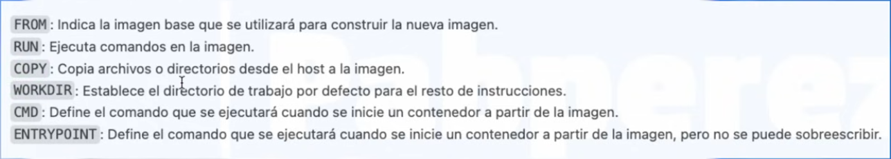
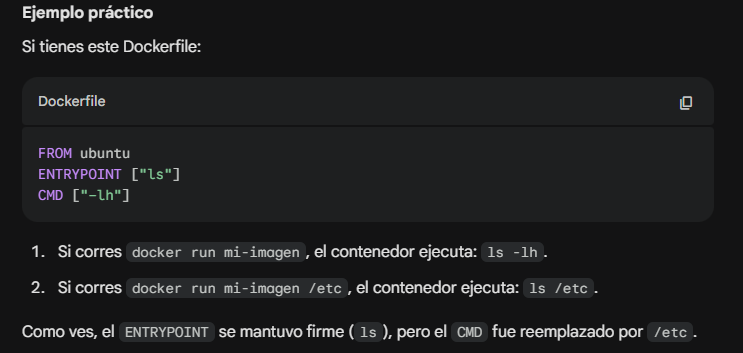
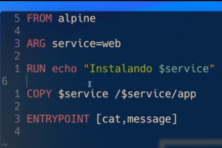
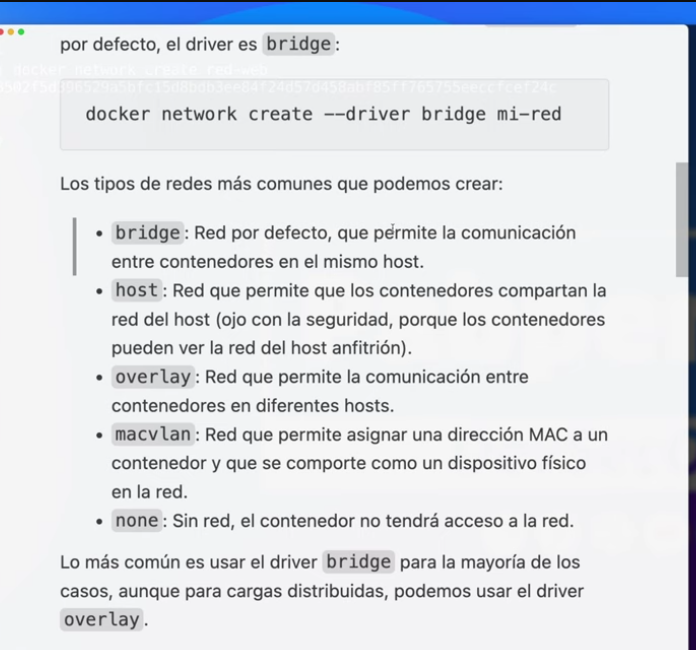
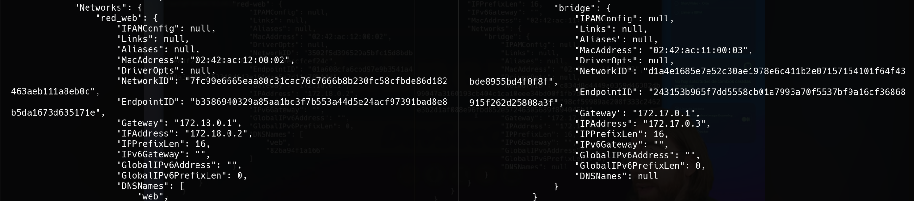
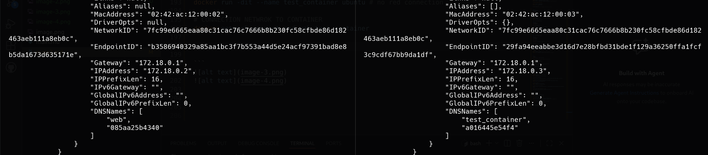

### 04
```bash
docker run nginx
docker ps
docker ps -a

```
#### Second plane
```bash
docker run -d nginx
# ans: hash
docker ps
docker logs <hash>
docker logs -f <hash> # live
docker attach <hash> # live without entering container

docker run -d --restart=always nginx # restart when mahcine restarts

```
#### port forwarding
```bash
docker run -d -p 8080:80 nginx # local:container


```
#### Bonus
```bash
docker run -d -p 8080:80 nginx # local:container

```
### 05
```bash
docker exec <hash> ls
docker exec <hash> whoami
docker exec <hash> id

docker exec -it 605ef914b5b9 bash

docker stop 605ef914b5b9

docker run -d --name web1 -p 8080:80 nginx  #naming containers. we can repeat names and ports

docker rm web2
docker container prune # remove stopped containers

```

### 06
```bash
docker pull nginx
docker image prune # deletes images without asociated containers
docker image prune -a

docker search nginx
```

### 07

```bash
docker build . -t app-nginx # build images
docker run -d --name web -p 8080:80 app-nginx # create container

localhost:8081/index.html

docker build -t app-python .
docker run -it app-python

# execution order
# most changed to minus changed like (like scripts)

```

### 08
#### ENTRYPOINT
```Dockerfile
FROM alpine

ENTRYPOINT ["echo", "Hola"]

CMD ["Mundo"]

```
```bash
docker build . -t test
docker run test
docker run test Edgerunners
```


#### ARG
```Dockerfile
FROM alpine

ARG NAME="Edibauer"

RUN echo "[+] Hola ${NAME}" > message

ENTRYPOINT ["cat", "message"]

``` 
```bash
docker build . -t test
docker build . -t test --build-arg=NAME="EdgeRunner"

docker run test

```


#### ENV
```Dockerfile
FROM python

COPY app.py .

ENTRYPOINT ["python3", "app.py"]

```
```python
import os

if os.getenv("DEBUG"):
    print("Modo depuracion activado")
else:
    print("Modo depuracion desactivado")

```
```bash
docker build . -t test
docker run test # MOdo depuracion desactivado
docker run -e DEBUG=true test # Modo depuracion activado


```
### 09
```bash
docker run -d --name web nginx

# make mcommit into docker image from container
docker commit /
    3693 /#containerID 
    nginx:modificada #tag

# EXPORTING IMAGES
docker save -o nginx.tar / # exporting name
    nginx:modificada # image and tag

# IMPORTING IMAGES
sudo docker load -i nginx.tar

# TAG
docker tag nginx:modificada nginx:v3.2


```

### 10 Volumes
```bash
docker volume
docker volume create my_new_volume
docker volume ls
docker volume inspect my_new_volume

# CREATING A CONTAINER
docker run -dit --name my_container -v my_new_volume:/main_data ubuntu /bin/bash

# CREATING A NEW CONTAINER WITH THE SAME VOLUME
docker run -dit --name my_container2 -v my_new_volume:/datos alpine
docker exec -it my_container2 sh

# DELETE VOLUME
docker volume rm my_new_volume
docker volume rm -f my_new_volume

# USING LOCAL DIR AS VOLUME
docker run -dit --name my_container3 -v /home/edibauer/Desktop/Docker/files:/app_dev ubuntu

# COPY FILES FROM CONTAINER TO LOCAL
sudo docker cp my_container3:/app_dev/test/test.txt .


```

### 11 Redes
```bash
docker network create red_web
docker network ls
docker network inspect red_web

# CREATING A CONTANIER
docker run -dit --name web --network red_web nginx
docker run -dit --name test_container ubuntu # no red connection

# CONNECTION NETWROK TO CONTAINER
docker network connect red_web test_container

# DISCONNECT
docker network disconnect red_web test_container

# DELETE
docker network rm red_web


```




### 12 Compose
```compose
services:
  web:
    image: nginx:latest
    ports:
      - "8080:80"

```
```bash
docker compose up -d

# USING NO COMPOSE FILE
docker compose -f despliegue.yml up

# USING DOCKER FILE
FROM nginx

## compose
services:
  web:
    image: nginx:latest
    ports:
      - "8080:80"
  web1:
    build: /home/edibauer/Desktop/Docker/12
    ports:
      - "8081:80"

# LIST COMPOSE CONTAINERS
docker compose ps

# EXEC
docker compose exec web sh

# DOWN
docker compose down

# ROUTING
## compose
services:
  web:
    image: nginx
  test:
    image: alpine
    stdin_open: true
    tty: true

docker compose exec test sh
curl web

# ans
<!DOCTYPE html>
<html>
<head>
<title>Welcome to nginx!</title>
<style>
html { color-scheme: light dark; }
body { width: 35em; margin: 0 auto;
font-family: Tahoma, Verdana, Arial, sans-serif; }
</style>
</head>
<body>
<h1>Welcome to nginx!</h1>
<p>If you see this page, the nginx web server is successfully installed and
working. Further configuration is required.</p>

<p>For online documentation and support please refer to
<a href="http://nginx.org/">nginx.org</a>.<br/>
Commercial support is available at
<a href="http://nginx.com/">nginx.com</a>.</p>

<p><em>Thank you for using nginx.</em></p>
</body>
</html>

```


